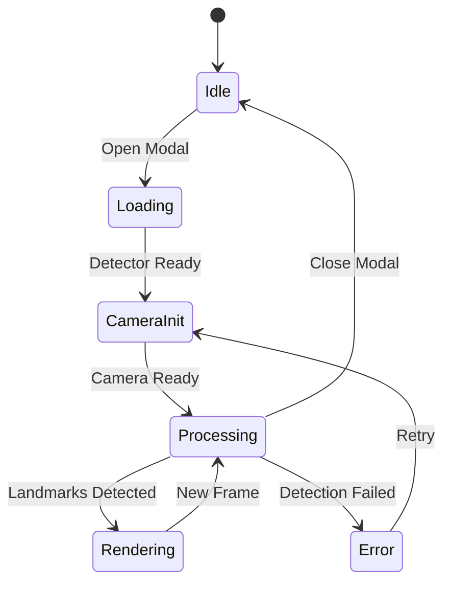

# Component Documentation

## Core Components

### 1. IdleAd Component

```typescript
// Location: src/components/IdleAd.tsx
interface IdleAdProps {
  images?: string[];           // Ad image URLs to display
  inactivityTimeout?: number;  // Time before showing ads (default: 30000ms)
  slideInterval?: number;      // Time between slides (default: 5000ms)
  transitionDuration?: string; // CSS transition duration (default: "500ms")
}
```

#### Description
Smart kiosk display component that shows a slideshow of ads when no person is detected in front of the camera.

#### Key Features
- Real-time person detection using MediaPipe
- Automated ad display management
- Configurable timing and transitions
- Resource-efficient operation
- Smooth fade transitions
- Full-screen display capabilities

#### Usage Example
```jsx
<IdleAd
  images={['/ads/ad1.png', '/ads/ad2.png']}
  inactivityTimeout={30000}
  slideInterval={5000}
  transitionDuration="500ms"
/>
```

### 2. VirtualTryOn Component

```typescript
// Location: src/components/VirtualTryOn.tsx
interface VirtualTryOnProps {
  isOpen: boolean;
  onClose: () => void;
  productImage: string;
  productName: string;
  jewelryType: JewelryType;
  detectorType: DetectorType;
}
```

#### Description
Main component handling the virtual try-on experience. Manages camera feed, ML model integration, and jewelry rendering.

#### Key Features
- Camera initialization and management
- Real-time video processing
- ML model integration
- Jewelry placement and rendering
- Error handling and user feedback

#### Usage Example
```jsx
<VirtualTryOn
  isOpen={true}
  onClose={() => setIsOpen(false)}
  productImage="/assets/necklace-1.png"
  productName="Gold Chain"
  jewelryType="CHAINS"
  detectorType="face"
/>
```

### 2. DetectorManager

```typescript
// Location: src/detectors/DetectorManager.ts
type DetectorType = 'face' | 'hands' | 'pose';
```

#### Description
Manages the loading and execution of MediaPipe ML models for face, hand, and pose detection.

#### Key Methods
- `loadDetector(type: DetectorType)`: Initializes specific ML models
- `runDetection(type: DetectorType, video: HTMLVideoElement)`: Processes video frames
- `initializeVisionResolver()`: Sets up MediaPipe vision tasks

### 3. JewelryPositioner

```typescript
// Location: src/utils/jewelry-positioner.ts
interface Placement {
  x: number;
  y: number;
  width: number;
  height: number;
  rotation?: number;
  side?: 'left' | 'right';
}
```

#### Description
Calculates optimal jewelry placement based on detected landmarks and jewelry type.

#### Supported Jewelry Types
- Necklaces & Chains
- Earrings (Left/Right)
- Nose Pins
- Rings
- Bracelets & Bangles
- Pendants
- Hip Belts
- Mathapatti (Forehead Ornaments)

## UI Components

### 1. ProductCard

```typescript
interface ProductCardProps {
  image: string;
  name: string;
  price: string;
  category: string;
  onTryOn: () => void;
}
```

### 2. CategoryDropdown

```typescript
interface CategoryDropdownProps {
  categories: string[];
  selected: string;
  onChange: (category: string) => void;
}
```

### 3. SearchModal

```typescript
interface SearchModalProps {
  isOpen: boolean;
  onClose: () => void;
  onSearch: (query: string) => void;
}
```

## State Management

### Key State Elements
- Camera status
- Detector loading status
- Current jewelry selection
- Try-on modal state
- Error states

### State Flow


## Error Handling

### Camera Errors
- Permission denied
- Device not found
- Initialization failed

### Detection Errors
- Model loading failed
- Processing errors
- Resource constraints

### Recovery Strategies
- Automatic retries
- User feedback
- Graceful degradation

## Performance Optimization

### Rendering Optimizations
- Frame rate control
- Canvas caching
- Batch updates

### Memory Management
- Resource cleanup
- Image preloading
- Stream management

## Event Handling

### User Interactions
- Camera permission requests
- Product selection
- Try-on controls

### System Events
- Window resize
- Visibility change
- Device orientation change