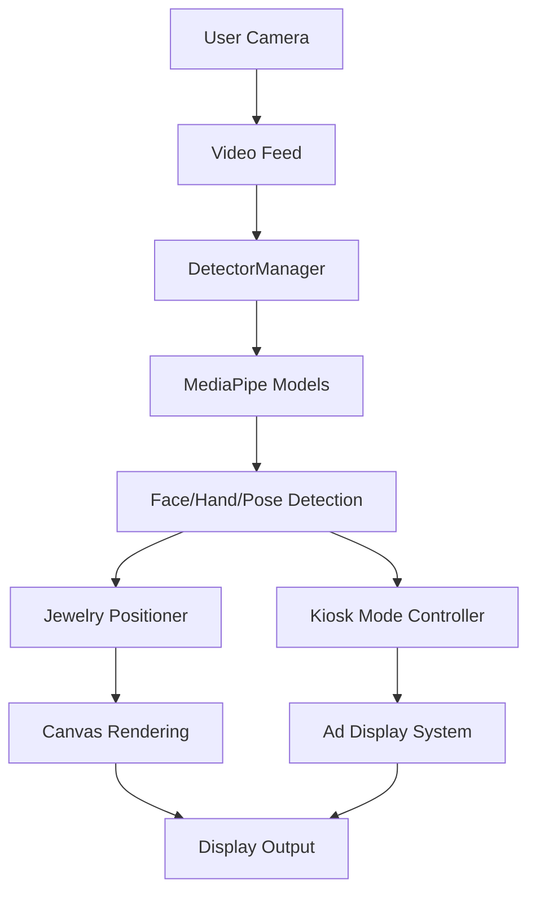

# Technical Overview

## System Architecture

The Virtual Jewelry Try-On system is built on a modern web stack with real-time video processing and AI-powered tracking capabilities.

### Core Components

### Key Technologies

1. **Video Processing Pipeline**
   - Real-time video capture
   - Frame rate optimization (30 FPS)
   - WebGL acceleration

2. **AI Models**
   - Face Landmark Detection (468 points)
   - Hand Tracking
   - Pose Estimation
   - Custom jewelry placement algorithms

3. **Rendering Engine**
   - Canvas-based rendering
   - Dynamic scaling and rotation
   - Real-time performance optimization

## Performance Considerations

### Frame Rate Management
- Target: 30 FPS
- Throttling mechanism for consistent performance
- Automatic quality adjustment

### Resource Usage
- GPU acceleration for ML models
- Memory management for video processing
- Efficient canvas operations

### Optimization Techniques
- Frame skipping for heavy operations
- Landmark caching
- Batch processing for multiple jewelry items

## Security and Privacy

### Camera Access
- HTTPS required for camera access
- Explicit user permission handling
- Secure video stream management

### Data Handling
- No video data storage
- Local-only processing
- Real-time computation only

## Browser Compatibility

### Minimum Requirements
- Chrome 80+
- Firefox 76+
- Safari 13+
- Edge 80+

### Required Features
- WebGL support
- MediaDevices API
- Canvas API
- WebAssembly support

## Kiosk Mode System

### Smart Display Management
- Real-time person detection using MediaPipe Face Detection
- Automated ad display system with configurable timers
- Intelligent state management for presence/absence detection
- Seamless transition between interactive and display modes

### Technical Specifications
- Detection rate: 30 FPS
- Response time: <100ms for presence detection
- Configurable inactivity timeout (default: 30 seconds)
- Smooth fade transitions (500ms default)
- Support for multiple ad formats and aspect ratios

### Resource Management
- Optimized camera feed processing
- Efficient memory usage through proper cleanup
- Automatic resource disposal when idle
- Background operation with minimal CPU usage

## Future Enhancements

1. **Planned Features**
   - Multi-face tracking
   - AR marker support
   - Mobile optimization
   - Custom jewelry upload
   - Advanced analytics for kiosk mode

2. **Performance Improvements**
   - WebWorker implementation
   - WebAssembly optimization
   - Reduced memory footprint
   - Enhanced detection algorithms

3. **UI Enhancements**
   - Touch gesture support
   - Advanced jewelry controls
   - Social sharing features
   - Customizable kiosk displays